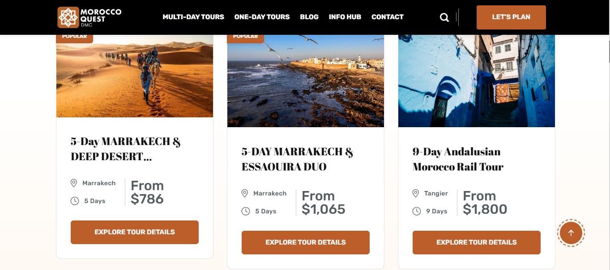
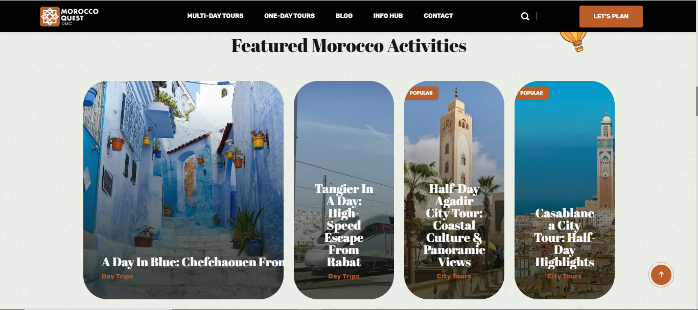

# 🇲🇦 Morocco Quest

**Morocco Quest** is a modern travel website showcasing unique experiences, tours, cities, and transportation options across Morocco. Built with Laravel and Filament, the platform offers a seamless user experience and an intuitive admin interface.

👉 **Live Website:** [https://morocco-quest.com](https://morocco-quest.com)

---

## ✨ Features

- Beautiful, responsive web design
- Dynamic listing of Moroccan cities and tours
- Filament-powered admin dashboard
- Simple and modern UI
- *(Coming soon)* Multilingual support (English, French, Arabic)

---

## 🚀 Tech Stack

- **Backend:** Laravel
- **Database:** MySQL
- **Admin Dashboard:** Filament PHP
- **Frontend:** HTML, CSS, JavaScript

---

## 📸 Screenshots

| Capture 1 | Capture 2 |
|-----------|-----------|
|  |  |

---

## 📦 Installation

Clone the repository and install dependencies:

```bash
git clone https://github.com/Rochdi7/tour-agency-laravel
cd morocco-quest

composer install
npm install
npm run build

cp .env.example .env
php artisan key:generate
```

Update your `.env` database credentials, then run migrations:

```bash
php artisan migrate
php artisan serve
```

## 🗺️ Project Structure

```
app/Models
app/Http/Controllers
resources/views
routes/web.php
public/assets
Filament dashboard
```

---

## 🔧 Example .env Settings

```dotenv
APP_NAME="YOur App Name"
APP_URL=http://localhost:8000

DB_CONNECTION=mysql
DB_HOST=127.0.0.1
DB_PORT=3306
DB_DATABASE=your_website_name
DB_USERNAME=root
DB_PASSWORD=
```

---

## 🛠️ Filament Dashboard

The admin dashboard is built with **Filament**:

- Manage tours, cities, and transport
- User-friendly UI
- Role and permission management

---

## 🚀 Roadmap

- [x] Initial live website launch
- [ ] Multilingual support
- [ ] Payment gateway for tour bookings
- [ ] SEO optimization

---

## 🤝 Contributing

Contributions welcome!

1. Fork the repo
2. Create your feature branch
3. Commit your changes
4. Push to your branch
5. Create a Pull Request

---

## 📄 License

MIT License

---

## 📞 Contact

- Website: [https://morocco-quest.com](https://morocco-quest.com)
- Email: rochdi.karouali1234@gmail.com
